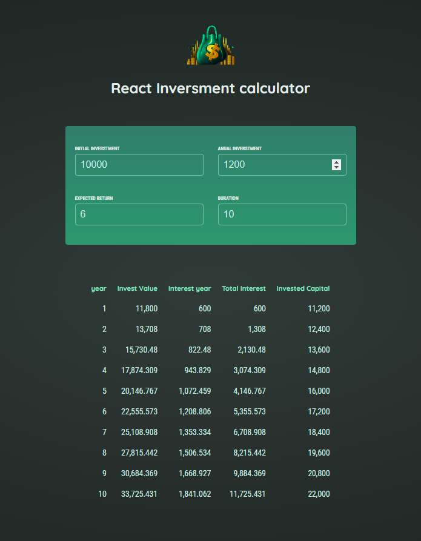

# React Investment Calculator

The React Investment Calculator is a web application designed to help users estimate the growth of their investments over time. By entering the initial investment, annual contribution, expected return rate, and investment duration, users can see a detailed year-by-year breakdown of their investment growth.

  <!-- Replace with the correct path to your image -->

## Features

- **Initial Investment:** Input the starting amount of money to be invested.
- **Annual Investment:** Input the amount of money to be added annually.
- **Expected Return:** Input the expected annual return rate (percentage).
- **Duration:** Input the number of years the investment will be held.
- **Year-by-Year Breakdown:** View the yearly investment value, interest earned, total interest, and invested capital.

## How to Use

1. **Enter Initial Investment:** Fill in the initial amount you plan to invest.
2. **Enter Annual Investment:** Fill in the amount you plan to add to the investment annually.
3. **Enter Expected Return:** Fill in the expected annual return rate.
4. **Enter Duration:** Fill in the number of years you plan to hold the investment.
5. **View Results:** See the detailed year-by-year breakdown of your investment growth.

## Installation

To run the React Investment Calculator locally, follow these steps:

1. Clone the repository:

    ```bash
    git clone https://github.com/yourusername/react-investment-calculator.git
    ```

2. Navigate to the project directory:

    ```bash
    cd react-investment-calculator
    ```

3. Install the dependencies:

    ```bash
    npm install
    ```

4. Start the development server:

    ```bash
    npm start
    ```

The app will be available at `http://localhost:3000`.

## Contributing

If you'd like to contribute to this project, please follow these steps:

1. Fork the repository.
2. Create a new branch: `git checkout -b my-feature-branch`.
3. Make your changes and commit them: `git commit -m 'Add some feature'`.
4. Push to the branch: `git push origin my-feature-branch`.
5. Submit a pull request.


